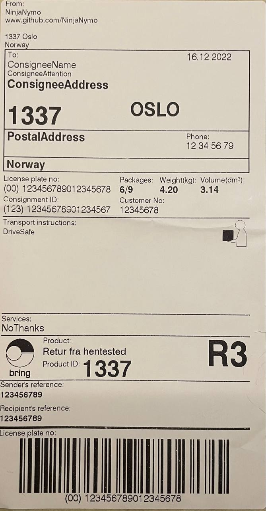

# PostenQR
Creating QR codes for Posten label printers.


## To-Do
- Experiment with line breaks in QR-code input.
- Experiment with removing fields.
- Experiment with order of fields.
- Experiment with other label types.
- Identify purpose of each data field.
- Identify type of QR-code(s) accepted by the scanners.
- Identify if the data format has a name.
- Create script for creating QR-codes.


# The Format:
The QR-codes contain a simple bar-separated ("|")  data format:
```
Label=3|ConsignorName=NinjaNymo|ConsignorAddress=www.github.com/NinjaNymo...
```
And seems to be terminated with an extra bar:
```
...KIDCODReference=||
```


# Example
Go to [this QR code generator](https://products.aspose.app/barcode/generate/qr), select _QR Code_ and _Large_ and paste the contents of [example.txt](example.txt).

Perhaps also consider modifying the string to match your own data.

Save the QR code to your phone, go to Posten, scan it and it should print something like this:



Magic.


# The Fields
_Blank fields means I don't know yet._

| Field | Description | Example Value | Blankable |
|-------|-------------|---------------|-----------|
|Label|Probably sticker layout?|3|
|ConsignorName|Sender name|NinjaNymo|
|ConsignorAddress|Sender url|www.github.com/NinjaNymo|
|ConsignorPostcode|Sender post code|1337|
|ConsignorCity|Sender city|Oslo|
|ConsignorCountry|Sender country|Norway|
|ConsigneeName|Recipient name|ConsigneeName|
|ConsigneeAttention|Recipient attention|ConsigneeAttention|
|ConsigneeAddress|Recipient address|ConsigneeAddress|
|Date|Date|16.12.2022|
|Postcode|Recipient post code|1337|
|City|Recipient city|OSLO|
|PostalAddress|Recipient address|PostalAddress|
|PhoneNumber|Recipient phone|12 34 56 79|
|AddressCountry|Recipient country|Norway|
|LicensePlate|Likely just string of parcel code|(00) 123456789012345678|
|NumberOfParcels|How many boxes, usually 1/1|6/9|
|Weight|kg|4.20|
|Volume|dm^3|3.14|
|ConsignmentID|Unclear, not same as parcel ID |(123) 12345678901234567|
|CustomerNumber|Probably senders customer number at Posten|12345678|
|TransportInstructions|Delivery instructions|DriveSafe|Yes
|AdditionalServices|"Services"|NoThanks|Yes
|ProductName|Probably connected to ProductID|Retur fra hentested|
|ProductID|Probably Posten product codes|1337|
|PriorityCode|Probably Posten priority code|R3|
|LicensePlateBarcode|Barcode data, numerals of LicensePlate|00123456789012345678|
|SenderReference|"Sender's reference"|123456789|
|RecipientReference|"Recipient's reference"|123456789|Yes
|CODAmount|||Yes
|BankAccount|||Yes
|KIDCODReference|||Yes


